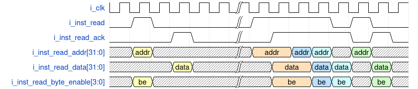

# ORC_R32I Synthesizable Unit Specification

Document        | Metadata
:-------------- | :------------------
_Version_       | v0.0.1
_Prepared by_   | Jose R Garcia
_Created_       | 2020/11/26 18:14:45
_Last modified_ | 2020/11/26 18:14:45
_Project_       | ORCs

## Overview

Verilog code for a FIR filter. As new values are fed through the input the filtered result goes out the streaming output synchronous to the input clock.

## Table Of Contents

<!-- TOC depthFrom:1 depthTo:6 withLinks:1 updateOnSave:1 orderedList:0 --> <!-- /TOC -->

 ## 1 Syntax and Abbreviations

Characters  | Definition
:---------- | :----------------------------
0b0         | Binary number syntax
0x0000_0000 | Hexadecimal number syntax
HART        | Hardware thread
HBI         | Handshake Bus Interface
ISA         | Instruction Set Architecture
LSB         | Least Significant bit
MSB         | Most Significant bit
FPGA        | Field Programmable Gate Array

## 2 Design

The ORC_R32I is an implementation of the RISC-V 32I ISA. It is a single threaded _hart_ capable of a single profile, machine mode.

The unit consumes instructions as portrayed by Figure 1.

|      
| :------------------------------------:
| Figure 1 : Instruction HBI Read Timing

## 3 Clocks and Resets

Signals        | Initial State | Direction | Definition
:------------- | :-----------: | :-------: | :--------------------------------------------------------------------
`i_clk`        |      N/A      |    In     | Input clock. Streaming interface fall within the domain of this clock
`i_reset_sync` |      N/A      |    In     | Synchronous reset. Used to reset this unit.

## 4 Interfaces

The ORC_R32I employs independent interfaces for reading the memory containing the instructions to be decoded and reading and writing to other devices such as memories and I/O devices.

### 4.1 Instruction HBI Master Read

Signals            | Initial State | Dimension | Direction | Definition
:----------------- | :-----------: | :-------: | :-------: | :-----------------------
`o_inst_read`      |      0b0      |   1-bit   |    Out    | Read request signal.
`i_inst_read_ack`  |      N/A      |   1-bit   |    In     | Read acknowledge signal.
`o_inst_read_addr` |  0x0000_0000  | `[31:0]`  |    Out    | Read Address signal.
`i_inst_read_data` |      N/A      | `[31:0]`  |    In     | Read response data.

### 4.2 Memory and I/O HBI Master Read

Signals              | Initial State | Dimension | Direction | Definition
:------------------- | :-----------: | :-------: | :-------: | :-----------------------
`o_master_read`      |      0b0      |   1-bit   |    Out    | Read request signal.
`i_master_read_ack`  |      N/A      |   1-bit   |    In     | Read acknowledge signal.
`o_master_read_addr` |  0x0000_0000  | `[31:0]`  |    Out    | Read Address signal.
`i_master_read_data` |      N/A      | `[31:0]`  |    In     | Read response data.

### 4.3 Memory and I/O HBI Master Write

Signals                      | Initial State | Dimension | Direction | Definition
:--------------------------- | :-----------: | :-------: | :-------: | :------------------------
`o_master_write`             |      0b0      |   1-bit   |    Out    | Write request signal.
`i_master_write_ack`         |      N/A      |   1-bit   |    In     | Write acknowledge signal.
`o_master_write_addr`        |  0x0000_0000  | `[31:0]`  |    Out    | Write Address signal.
`i_master_read_data`         |      N/A      | `[31:0]`  |    In     | Write response data.
`o_master_write_byte_enable` |      0x0      |  `[3:0]`  |    Out    | Write response data.

## 5 Generic Parameters

Parameters              |   Default   | Description
:---------------------- | :---------: | :---------------------------------------------------
`P_FETCH_COUNTER_RESET` | 0x0000_0000 | Initial address fetched by the Instruction HBI Read.

## 6 Register Space

Address Range | Description
:-----------: | :-----------------
   [0:31]     | General Registers.

### 6.1 General Register _n_

Bits | Access |    Reset    | Description
:--: | :----: | :---------: | :----------------
31:0 |   RW   | 0x0000_0000 | General register.

## 7 Directory Structure

- `build` _contains build scripts, synthesis scripts, build constraints, build outputs and bitstream_
- `sim` _contains simulation scripts and test bench files_
- `source` _contains source code file (*.v)_

## 8 Simulation

Simulation scripts assumes _Icarus Verilog_ (iverilog) as the simulation tool. From the /sim directory run make. Options available are

Command    | Description
:--------- | :--------------------------------------------------------------------
make all   | cleans, compiles and runs the test bench, then it loads the waveform.
make test  | compiles the test bench and UUT
make run   | runs the simulation
make wave  | loads the waveform in gtkwave
make clean | cleans all the compile and simulation products

## 9 Synthesis

Synthesis scripts assume _Yosys_ as the tool for synthesizing code and _Lattice ICE HX-8K_ as the target FPGA device.

## 10 Build

Build scripts are written for the Icestorm tool-chain. The target device is the hx8kboard sold by Lattice.
