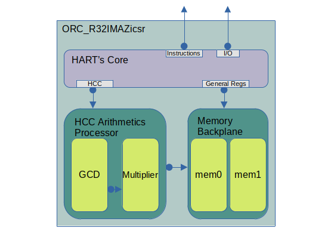

# ORC_R32IMAZicsr Synthesizable Unit Specification

Document        | Metadata
:-------------- | :------------------
_Version_       | v0.0.1
_Prepared by_   | Jose R Garcia
_Created_       | 2020/12/25 13:39:12
_Last modified_ | 2021/01/07 00:52:39
_Project_       | ORCs

## Overview

The ORC_R32IMAZicsr is an implementation of the RISC-V 32-bit I,M,A,Z and CSR ISA extensions. It is a single threaded _hart_ capable of booting modern operating systems.

## Table Of Contents

<!-- TOC depthFrom:1 depthTo:6 withLinks:1 updateOnSave:1 orderedList:0 --> - [ORC_R32IMAZicsr Synthesizable Unit Specification](#orcr32imazicsr-synthesizable-unit-specification)
  - [Overview](#overview)
  - [Table Of Contents](#table-of-contents)
  - [1 Syntax and Abbreviations](#1-syntax-and-abbreviations)
  - [2 Design](#2-design)
  - [3 Clocks and Resets](#3-clocks-and-resets)
  - [4 Interfaces](#4-interfaces)
    - [4.1 Instruction HBI Master Read](#41-instruction-hbi-master-read)
    - [4.2 Memory and I/O HBI Master Read](#42-memory-and-io-hbi-master-read)
    - [4.3 Memory and I/O HBI Master Write](#43-memory-and-io-hbi-master-write)
  - [5 Generic Parameters](#5-generic-parameters)
  - [6 Register Space](#6-register-space)
    - [6.1 General Register _n_](#61-general-register-n)
  - [7 Directory Structure](#7-directory-structure)
  - [8 Simulation](#8-simulation)
  - [9 Synthesis](#9-synthesis)
  - [10 Build](#10-build)<!-- /TOC -->

 ## 1 Syntax and Abbreviations

Term        | Definition
:---------- | :---------------------------------------------
0b0         | Binary number syntax
0x0000_0000 | Hexadecimal number syntax
bit         | Single binary digit (0 or 1)
BYTE        | 8-bits wide data unit
DWORD       | 32-bits wide data unit
FPGA        | Field Programmable Gate Array
GCD         | Goldschmidt Convergence Division
HART        | Hardware thread
HCC         | High Computational Cost Arithmetics Processor
ISA         | Instruction Set Architecture
LSB         | Least Significant bit
MSB         | Most Significant bit
WB          | Wishbone Interface

## 2 Design

The ORC_R32IMAZicsr uses a Harvard architecture, separating the interface used to access the instructions from the interface used to access external devices. The general purpose register are implemented in single port BRAMs. In order to access the rs1 and rs2 simultaneously to copies of the general purpose register are created. 

|      
| :------------------------------------:
| Figure 1 : Top Level Diagram

### 2.1 HART Core

The Program Counter process fetches the instructions by asserting the instruction interface strobe signal, thus validating the address signal and waits for the acknowledge to be asserted in response which validates the data signal. 

The unit consumes instructions as portrayed by Figure 1.

|      
| :------------------------------------:
| Figure 2 : Instruction HBI Read Timing

### 2.2 High Computational Cost Arithmetics Processor

This module handles both integer division and multiplication operations. It has the option of selecting between an instance of ANLOGIC specific DSP block or a generic multiplication that modern synthesis tools can map to other FPGA technologies. The division is handled by Goldschmidt divider module.

#### 2.2.1 Integer Multiplier

TBD

#### 2.2.2 Goldschmidt Convergence Division

The Goldschmidt division is an special application of the Newton-Raphson method. This iterative divider computes:

    d(i) = d[i-1].(2-d[i-1])
             and
    D(i) = D[i-1].(2-d[i-1])

were 'd' is the divisor; 'D' is the dividend; 'i' is the step. D converges toward the quotient and d converges toward 1 at a quadratic rate. For the divisor to converge to 1 it must obviously be less than 2 therefore integers greater than 2 must be multiplied by 10 to the negative powers to shift the decimal point. Consider the following example:

Step  | D                | d                 | 2-d
----: | :--------------- | :---------------- | :---------------
.	    | 16	             | 4                 | 1.6
0	    | 1.6	             | 0.4               | 1.36
1	    | 2.56             | 0.64              | 1.1296
2	    | 3.4816           | 0.8704            | 1.01679616
3	    | 3.93281536       | 0.98320384        | 1.00028211099075
4	    | 3.99887155603702 | 0.999717889009254 | 1.00000007958661
5	    | 3.99999968165356 | 0.999999920413389 | 1.00000000000001
5	    | 3.99999968165356 | 0.999999920413389 | 1.00000000000001
6     | 3.99999999999997 | 0.999999999999994 | 1
7     | 4                | 1                 | 1

The code implementation compares the size of the divisor against 2*10^_n_ were _n_ is a natural number. The result of the comparison indicates against which 10^_m_, were _m_ is a negative integer, to multiply the divisor. Then the Goldschmidt division is performed until the divisor converges to degree indicated by `P_GCD_ACCURACY`. The quotient returned is the rounded up value to which the dividend converged to. Each Goldschmidt step is performed in to two half steps in order use only one multiplier and save resources.
    
The remainder calculation requires an extra which is why the address tag is used to make the decision on whether to do the calculation or skip it. The calculation simply take the value after the decimal point of the quotient a multiplies it by the divisor.

### 2.3 Memory Backplane

TBD

## 3 Clocks and Resets

Signals        | Initial State | Direction | Definition
:------------- | :-----------: | :-------: | :--------------------------------------------------------------------
`i_clk`        |      N/A      |    In     | Input clock. Streaming interface fall within the domain of this clock
`i_reset_sync` |      N/A      |    In     | Synchronous reset. Used to reset this unit.

## 4 Interfaces

The ORC_R32I employs independent interfaces for reading the memory containing the instructions to be decoded and reading and writing to other devices such as memories and I/O devices.

### 4.1 Instruction WB Master Read

Signals            | Initial State | Dimension | Direction | Definition
:----------------- | :-----------: | :-------: | :-------: | :-----------------------
`o_inst_read_stb`  |      0b0      |   1-bit   |    Out    | Read request signal.
`i_inst_read_ack`  |      N/A      |   1-bit   |    In     | Read acknowledge signal.
`o_inst_read_addr` |  0x0000_0000  | `[31:0]`  |    Out    | Read Address signal.
`i_inst_read_data` |      N/A      | `[31:0]`  |    In     | Read response data.

### 4.2 Memory and I/O WB Master Read

Signals              | Initial State | Dimension | Direction | Definition
:------------------- | :-----------: | :-------: | :-------: | :-----------------------
`o_master_read_stb`  |      0b0      |   1-bit   |    Out    | Read request signal.
`i_master_read_ack`  |      N/A      |   1-bit   |    In     | Read acknowledge signal.
`o_master_read_addr` |  0x0000_0000  | `[31:0]`  |    Out    | Read Address signal.
`i_master_read_data` |      N/A      | `[31:0]`  |    In     | Read response data.

### 4.3 Memory and I/O WB Master Write

Signals                | Initial State | Dimension | Direction | Definition
:--------------------- | :-----------: | :-------: | :-------: | :------------------------
`o_master_write_stb`   |      0b0      |   1-bit   |    Out    | Write request signal.
`i_master_write_ack`   |      N/A      |   1-bit   |    In     | Write acknowledge signal.
`o_master_write_addr`  |  0x0000_0000  | `[31:0]`  |    Out    | Write Address signal.
`i_master_read_data`   |      N/A      | `[31:0]`  |    In     | Write response data.
`o_master_write_sel`   |      0x0      |  `[3:0]`  |    Out    | Write byte enable

## 5 Configurable Parameters

Parameters              |   Default  | Description
:---------------------- | :--------: | :---------------------------------------------------
`P_FETCH_COUNTER_RESET` |      0     | Initial address fetched by the Instruction WB Read.
`P_MEMORY_ADDR_MSB`     |      4     | Log2(Number_Of_Total_Register)-1 
`P_MEMORY_DEPTH`        |     32     | Memory space depth.
`P_DIV_ACCURACY`        |     12     | Divisor Convergence Threshold. How close to one does it get to accept the result. These are the 32bits after the decimal point, 0.XXXXXXXX expressed as an integer. The default value represent the 999 part of a 64bit binary fractional number equal to 0.999.
`P_IS_ANLOGIC`          |      0     | When '0' it generates generic BRAM and multiplier. When '1' it generates ANLOGIC BRAMs and DSPs targeting the SiPEED board. 

## 6 Memory Map

| Memory Space | Address Range | Description
|:-----------: | :-----------: | :-----------------
| mem0         |     [0:31]    | General Registers.
| mem1         |     [0:31]    | General Registers.

### 6.1 General Register, mem0 and mem1

|          Address          | Bits | Access |    Reset    | Description
|:------------------------: | :--: | :----: | :---------: | :----------------
| [0x0000_0000:0x0000_001F] | 31:0 |   RW   | 0x0000_0000 | General register.

## 7 Directory Structure

- `build` _contains build scripts, synthesis scripts, build constraints, build outputs and bitstreams_
- `sim` _contains simulation scripts and test bench files_
- `source` _contains source code files (*.v)_

## 8 Simulation

Simulation scripts assumes _Icarus Verilog_ (iverilog) as the simulation tool. From the /sim directory run make. Options available are

Command       | Description
:------------ | :--------------------------------------------------------------------
`make`        | cleans, compiles and runs the test bench, then it loads the waveform.
`make clean`  | cleans all the compile and simulation products

## 9 Synthesis

Synthesis scripts assume _Yosys_ as the tool for synthesizing code and _Lattice ICE UP5K_ as the target FPGA device.

Command              | Description
:------------------- | :----------------------
`yosys syn_ice40.ys` | runs synthesis scripts.

## 10 Build

Build scripts are written for the Icestorm tool-chain. The target device is the up5k sold by Lattice.

Command    | Description
:--------- | :-----------------------------------------------------
`make all` | cleans, compiles and runs synthesis and build scripts.
