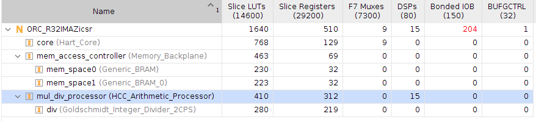
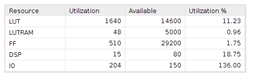

# Build Examples (Core only)

## Lattice_UP5K
 This design does not fit in the UP5K but the synthesis script is quick and provides a good estimate of resource comsuption for 4-input LUT based technologies.

## Sipeed_PriMER
# Results : Resources and Timing Estimates
_These results should be considered experimental as work is still under progress and this only accounts for I and M instructions. Remember to set P_IS_ANLOGIC = 1 in the ORC_R32IMAZicsr module_

## TD Workflow (uses BRAMs)

### Synthesis and Mapping

| IO Statistics |           |
| :------------ | --------: |
| #IO           |       204 |
|   #input      |        69 |
|   #output     |       135 |
|   #inout      |         0 |

|Utilization Statistics|     |                  |       |
| :------------------ | ---: | :--------------: | ----: |
| #lut                | 2901 |   out of  19600  | 14.80%|
| #reg                |  451 |   out of  19600  |  2.30%|
| #le                 | 2908 |          -       |     - |
|   #lut only         | 2457 |   out of   2908  | 84.49%|
|   #reg only         |    7 |   out of   2908  |  0.24%|
|   #lut&reg          |  444 |   out of   2908  | 15.27%|
| #dsp                |   15 |   out of     29  | 51.72%|
| #bram               |    4 |   out of     64  |  6.25%|
|   #bram9k           |    4 |        -         |  -    |
|   #fifo9k           |    0 |        -         |   -   |
| #bram32k            |    0 |   out of     16  |  0.00%|
| #pad                |  204 |   out of    188  |108.51%|
|   #ireg             |    8 |        -         |   -   |
|   #oreg             |    0 |        -         |   -   |
|   #treg             |    0 |        -         |   -   |
| #pll                |    0 |   out of      4  |  0.00%|

               

|Report Hierarchy Area: |  | | | |
:-------- | :-------- | :---- |:------| :---- |
| Instance | Module   | le    | lut   | seq   |
| top      | ORC_R32I | 2908  | 2901  | 451   |

## Vivado
 
 
 
