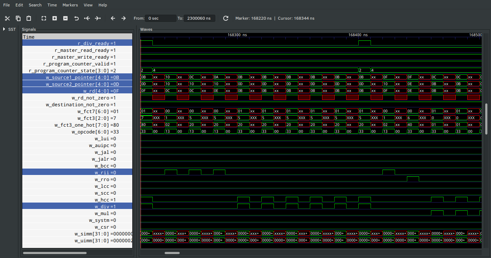

# ORCs

**O**pen-source **R**ISC-V **C**ores
This project aims to create a collection of _harts_ complaint to the RISC-V ISA. Unlike other projects, this one does not seek to create the smallest risc-v implementation but rather experiment on implementations the risc-v ISA on accessible or popular FPGA dev boards focusing on performance first and resource cost second.

## ORC_R32IMAZicsr (Main Branch)

### Abstract

A 32-bit RISC-V ISA implementation capable of booting a modern OS (Linux, BSD...). As features get implemented new git branches will be created for code implementation of the different instruction. Currently there are three branches, the main branch (this branch), an r32i and an r32im branch. The code in the repos might not work or contain bugs, try sticking to the releases (tags) for working code.

### Requirements

Support ISA's : integer (I), multiplication and division (M), CSR instructions (Z) and atomics (A) extensions
Supports User, Supervisor and Machine mode privilege profiles.

### Performance

#### Dhrystone Benchmark (Version 2.1)

No two Dhrystone benchmark are the same since this is a compiler/core benchmark. Therefore a third party core was benchmarked and included for comparison.

Dhrystone test bench found in the picorv32 repo (https://github.com/cliffordwolf/picorv32/tree/master/dhrystone) was used and the same compiled code (hex file) on all cores for comparison.
Implementation                                                | CFLAGS (-march=) | Runs |         User Time         | Cycles/Instruction | Dhrystones/Sec/MHz | DMIPS/MHz
:------------------------------------------------------------ | :--------------: | :--: | :-----------------------: | :----------------: | :----------------: | :-------:
ORC_R32IMAZicsr (main, bypass, no I$ support, aggressive div*)|       rv32im     | 100  | 53261 cycles,  26125 insn |       2.038        |       1876         |   1.068
ORC_R32IMAZicsr (main, bypass, no I$ support, accurate div**) |       rv32im     | 100  | 53472 cycles,  26136 insn |       2.045        |       1870         |   1.064
ORC_R32IMAZicsr (no bypass, supports I$, aggressive div*)   Theoretical Maximums with Instruction Cache ->|       rv32im     | 100  | 53261 cycles,  26125 insn   38150 cycles, 26125 insn | 2.038   1.460 | 1876   2620 | 1.068   1.501
ORC_R32IMAZicsr (no bypass, supports I$, accurate div**)   Theoretical Maximums with Instruction Cache -> |       rv32im     | 100  | 53472 cycles,  26136 insn   38360 cycles, 26136 insn | 2.045   1.467 | 1870   2606 | 1.064   1.483
ORC_R32IMAZicsr (main)                                        |       rv32i      | 100  | 58072 cycles,  29036 insn |       2.000        |       1722         |   0.980
ORC_R32IM_BRAM (branch)                                       |       rv32im     | 100  | 78602 cycles,  26136 insn |       3.007        |       1272         |   0.724
ORC_R32I_BRAM  (branch)                                       |       rv32i      | 100  | 85802 cycles,  29036 insn |       2.955        |       1165         |   0.663
picorv32                                                      |       rv32im     | 100  | 107758 cycles, 26136 insn |       4.122        |        928         |   0.528
picorv32                                                      |       rv32i      | 100  | 113154 cycles, 29036 insn |       3.897        |        883         |   0.502
picorv32 (no look ahead)                                      |       rv32im     | 100  | 145013 cycles, 26136 insn |       5.548        |        689         |   0.392
picorv32 (no look ahead)                                      |       rv32i      | 100  | 153707 cycles, 29036 insn |       5.293        |        650         |   0.369

Number_Of_Runs: 100
User_Time: 38360 cycles, 26136 insn
Cycles_Per_Instruction: 1.467
Dhrystones_Per_Second_Per_MHz: 2606
DMIPS_Per_MHz: 1.483

__*__ Top level parameters for an aggressive division(convergence in accepted more loosely) 

    P_DIV_ACCURACY    = 12
    P_DIV_ROUND_LEVEL = 2 

__**__ Top level parameters for an accurate division(convergence in accepted when divisor is really close to 1) 

    P_DIV_ACCURACY    = 24
    P_DIV_ROUND_LEVEL = 3 

__*NOTE*__ Sadly the compiled Dhrystone benchmark cannot take advantage of the implemented bypass.

#### Clocks Per Instructions

| _________\ Pipeline Stage   Instruction \ ___________ | Fetch | Decode | Register | Response | Total Clocks |
|:-------------------------------------------------------- |:-----:|:------:|:--------:|:--------:|:------------:|
| LUI                                                      |  ✔️    |  ✔️     |          |          | 2            |
| AUIPC                                                    |  ✔️    |  ✔️     |          |          | 2            |
| JAL                                                      |  ✔️    |  ✔️     |          |          | 2            |
| JALR                                                     |  ✔️    |  ✔️     |  ✔️       |          | 2            |
| BRANCH                                                   |  ✔️    |  ✔️     |  ✔️       |          | 2            |
| R-R                                                      |  ✔️    |  ✔️     |  ✔️       |          | 2            |
| R-I                                                      |  ✔️    |  ✔️     |  ✔️       |          | 2            |
| Load                                                     |  ✔️    |  ✔️     |  ✔️       |  ✔️       | 3*           |
| Store                                                    |  ✔️    |  ✔️     |  ✔️       |  ✔️       | 3*           |
| Multiply                                                 |  ✔️    |  ✔️     |  ✔️       |  ✔️       | 3            |
| Division                                                 |  ✔️    |  ✔️     |  ✔️       |  ✔️       | 3 to 18**    |

_*minimum_

_**minimum, spcecial cases like dividing by one or zero or when the factors are the same. But on average the divider takes 6 Goldschmidt steps which are implemented in two half steps plus the numbers need to be conditioned for the divider. For these reasons division takes 18 clock on average._

_**Note:**_ The fetch of the instruction is included in the table, unlike the literature of other projects out there since it can actually impact the overall performance(that is why some implementations in the wild have look-ahead fetching or fetch two instructions at a time, to give some examples).

#### Simulation Waveform Output

##### Waveform snippet for reference

 

##### Waveform snippet of the division module.

 

##### Waveform snippet of the division bypass.
When a DIV instruction received the `r_div_ready` will be set low and it will continue processing subsequent instructions until an instruction creates a conflict by trying to access the DIV instruction rd, reading or writing to it, or by trying to perform another DIV. 

 

### Current State

**_Under Progress_**

#### To Do

1. ~~Currently adapting ORC's R32I per lessons learned.~~
2. ~~Finishing the implementation of the M instructions.~~
3. ~~Start implementing the CSRs starting with the counters in order to be able to run the pico32 Dhrystone benchmark.~~
4. ~~Update the code to use lutrams so save 1 clock.~~
5. ~~Get rid of the HCC processor and separate the MUL multiplier from the DIV multiplier. The DSP block savings is not justifying the cost in clocks.~~
6. ~~Add bypass to process instructions while waiting for load, stores and divs to finish.~~
7. Finish implementing the CSRs, and FENCE.
8. Implement the "A" instructions.
9. Add more documentation 
10. Make a 1 clock per step divider.
10. Add an I$.

_**Note:**_ 

To synthesize the code for the Sipeed PriMER ANLOGIC FPGA BOARD simply set the parameter `P_IS_ANLOGIC` to 1. When using yosys or Xilinx using Vivado set the parameter to 0. This parameter is declared at the top level wrapper, ORC_R32IMAZicsr.v.

Sadly the division uses more DSP blocks than what the Lattice 5k has to offer and the ANLOGIC FPGA in the SiPEED board only has enough DSP block for a pipelined division. I will create a faster non-pipeline division module for larger fpgas like the A7 or S7 found in the Arty boards. Also Vivado results show the most critical timing path is associated to the DSP blocks, therefore there is a risk of having to reduce the clock rate for a non-pipelined version.

## Future Work

After the ORC_R32IMAZicsr I will probably target a low resource costs implementation.
