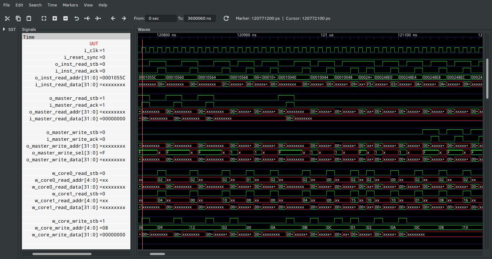
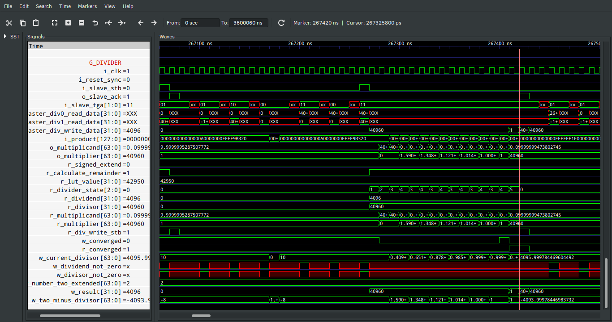

# ORCs
**O**pen-source **R**ISC-V **C**ores
This project aims to create a collection of _harts_ complaint to the RISC-V ISA. Unlike other projects, this one does not seek to create the smallest risc-v implementation but rather experiment on implementations the risc-v ISA on accessible or popular FPGA dev boards focusing on performance first and resource cost second.

## ORC R32I

### Abstract
RV32I un-privileged hart implementation directory. Contains the source code, simulation files and examples for synthesis and place-and-route.

This project is currently under progress. It uses previous work from the DarkRISCV project (https://github.com/darklife/darkriscv) as a starting reference.  Kept the concept of having two copies of the general purpose register for a faster access. The instruction interface was swap from a streaming interface to a memory interface(Wishbone pipeline). The counter and decoder have change so much the look very different now.

The ORC_R32I/source folder contains more on the specifications and the verilog code. For resource cost see the results in ORC_R32I/build/ 

## Goal 

A 32-bit RISC-V ISA integer (I) extensions implementation.

### Current State

**_Under Progress_**

The code synthesizes, which provides a reference on possible FPGA resource usage and timing. The test bench is under progress but currently simulation looks promising. It is being written using uvm-python and cocotb.

The design build results for the Lattice HX8K can be found in the build directory, it consumes about 20% of the cells and about ~1377 LUTs and can close timing with a clock of ~50MHz depending on PnR.

For a Xilinx S7 like the one in the Arty board it will consume ~1100 LUTs and runs up to 140MHz of clock speed.

The current code will ~~not~~ work for Anlogic FPGAs. The attempt to synthesize the code targeting the Sipeed TANG PriMER FPGA board  resulted on crashing Tang Dynasty, (V4.6.18154). Looks like the BRAMs need to be created using their IP generator and then instantiate that module withing the code unlike other synthesis software that would do that automagicly. Therefore a special code(untested) is the SiPEED build folder. That code contains the BRAM generated by TD. But wait, there is more! The actual code (the one from source) will synthesize with Yosys and the result can then be handled by TD but instead of BRAM it results in using lutrams.

### Performance

#### Clocks Per Instructions
 _________\ Pipeline Stage   Instruction \ ___________ | Fetch | Decode | Register | Response | Total Clocks
:---------- | :---: | :----: | :------: | :------: | :----------:
LUI         |   ✔️   |    ✔️   |          |          |      2
AUIPC       |   ✔️   |    ✔️   |          |          |      2
JAL         |   ✔️   |    ✔️   |          |          |      2
JALR        |   ✔️   |    ✔️   |     ✔️    |          |      3
BRANCH      |   ✔️   |    ✔️   |     ✔️    |          |      3
R-R         |   ✔️   |    ✔️   |     ✔️    |          |      3
R-I         |   ✔️   |    ✔️   |     ✔️    |          |      3
Load        |   ✔️   |    ✔️   |     ✔️    |    ✔️     |      4*
Store       |   ✔️   |    ✔️   |     ✔️    |    ✔️     |      4*

_*minimum_

_**Note:**_ The fetch of the instruction is included in the table, unlike the literature of other projects out there since it can actually impact the overall performance(that is why some implementations in the wild have look-ahead fetching or fetch two instructions at a time, to give some examples).

#### Simulation Waveform Output 

This is a waveform snippet for reference 

 

### Tools Directory
Collection of tools for compiling, synthesizing, building, simulating and verifying the implementations. **A recursive GIT clone takes about 7GB of disk space.**

### To Do 
Finish test bench, benchmark and build an integrated example... and work on fixes for bugs yet to be discovered.

There was a bug related to S type instructions where it could assume the instruction should be dropped due to rd being 0. **This bug is in the process of being squashed.**

## ORC_R32IMAZicsr

### Goal

A 32-bit RISC-V ISA implementation capable of booting a modern OS (Linux, BSD...).

### Requirements 
Support ISA's : integer (I), multiplication and division (M), CSR instructions (Z) and atomics (A) extensions
Supports User, Supervisor and Machine mode privilege profiles.

### Performance

#### Clocks Per Instructions
 _________\ Pipeline Stage   Instruction \ ___________ | Fetch | Decode | Register | Response | Total Clocks
:---------- | :---: | :----: | :------: | :------: | :----------:
LUI         |   ✔️   |    ✔️   |          |          |      2
AUIPC       |   ✔️   |    ✔️   |          |          |      2
JAL         |   ✔️   |    ✔️   |          |          |      2
JALR        |   ✔️   |    ✔️   |     ✔️    |          |      3
BRANCH      |   ✔️   |    ✔️   |     ✔️    |          |      3
R-R         |   ✔️   |    ✔️   |     ✔️    |          |      3
R-I         |   ✔️   |    ✔️   |     ✔️    |          |      3
Load        |   ✔️   |    ✔️   |     ✔️    |    ✔️     |      4*
Store       |   ✔️   |    ✔️   |     ✔️    |    ✔️     |      4*
Multiply    |   ✔️   |    ✔️   |     ✔️    |    ✔️     |      4
Division    |   ✔️   |    ✔️   |     ✔️    |    ✔️     |      4 to 18**

_*minimum_

_**minimum, spcecial cases like dividing by one or zero or when the factors are the same. But on average the divider takes 6 Goldschmidt steps which are implemented in two half steps plus the numbers need to be conditioned for the divider. For these reasons division takes 18 clock on average._

_**Note:**_ The fetch of the instruction is included in the table, unlike the literature of other projects out there since it can actually impact the overall performance(that is why some implementations in the wild have look-ahead fetching or fetch two instructions at a time, to give some examples).

#### Simulation Waveform Output 

##### This is a waveform snippet for reference 

 

##### This is a waveform snippet of the division module.

 

### Current State

**_Under Progress_**

1.  ~~Currently adapting ORC's R32I per lessons learned.~~
2.  ~~Finishing the implementation of the M instructions.~~
3.  Start implementing the CSRs starting with the counters in order to be able to run the pico32 Dhrystone benchmark.

To synthesize the code for the Sipeed PriMER ANLOGIC FPGA BOARD simply set the parameter `P_IS_ANLOGIC` to 1. When using yosys or Xilinx using Vivado set the parameter to 0. This parameter is declared at the top level wrapper, ORC_R32IMAZicsr.v.

Sadly the division uses more DSP blocks than what the Lattice 5k has to offer and the ANLOGIC FPGA in the SiPEED board only has enough DSP block for a pipelined division. I will create a faster non-pipeline division module for larger fpgas like the A7 or S7 found in the Arty boards. Also Vivado results show the most critical timing path is associated to the DSP blocks, therefore there is a risk of having to reduce the clock rate for a non-pipelined version.

### To Do

1.  Implement the CSR, Z, and  A instructions and implement a proper FENCE mechanism once the CSRs are added.
2.  Add more documentation.

## Future Work

After the ORC_R32IMAZicsr I will probably target a low resource costs implementation.
